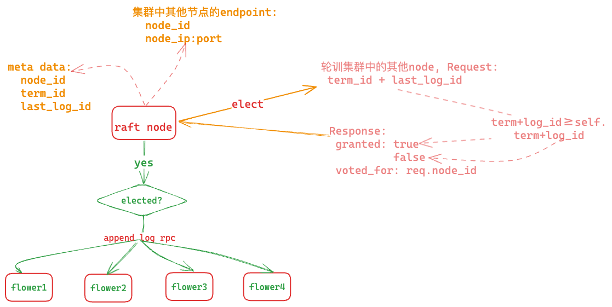

# raftkv

结合 [raft 论文](https://github.com/maemual/raft-zh_cn/blob/master/raft-zh_cn.md)以及参考[drmingdrmer](https://github.com/drmingdrmer)的[one-file-raft](https://github.com/drmingdrmer/one-file-raft/tree/main)项目，实现一个基于的 raft 算法的 kv 存储系统。

[one-file-raft](https://github.com/drmingdrmer/one-file-raft/tree/main)项目使用了 rust 中的 `mspc` 以及 `watch::channel` 来模拟网络通信，虽然简化了 demo 的实现，但对于新手来说可能不太容易理解，所以本人准备使用 `grpc` 重写一遍，同时也会基于 raft 共识算法实现一个简单的 kv 存储系统（也许不一定实现，一个 ⛳）。

为简化实现，本项目将不会实现持久化存储，即每次重启都会丢失数据，自然复制状态机部分也暂不实现，仅仅实现 raft 算法的核心功能。

